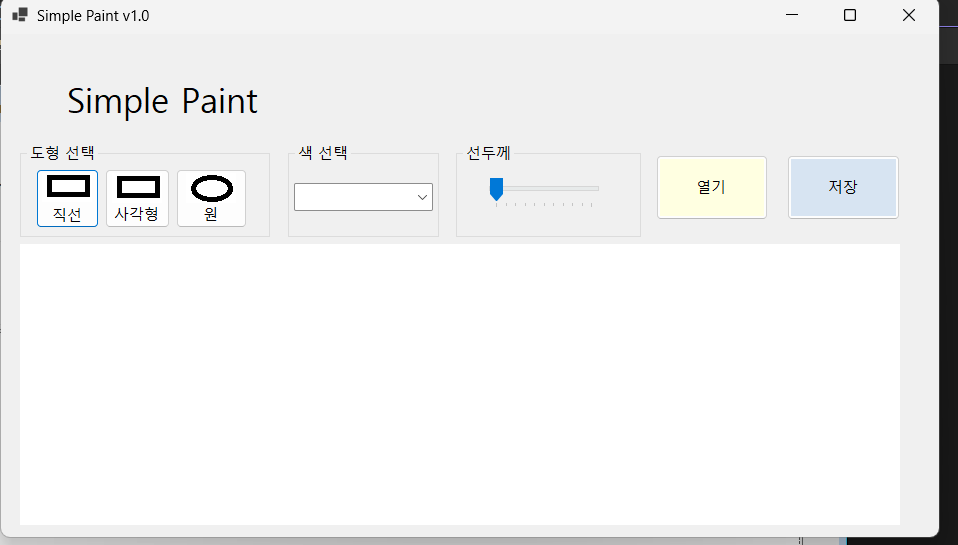
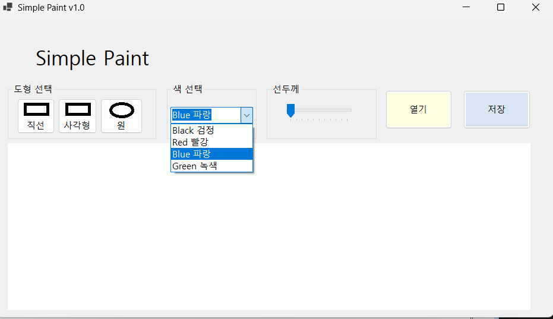

# (C# 코딩) 그림판
## 개요-C# 
프로그래밍학습
-1줄 소개: 직선, 사각형, 원을그릴수있는그림판을만들 수 있습니다.

-사용한플랫폼: 
-C#, .NET Windows Forms, Visual Studio, GitHub

-사용한컨트롤:
-PictureBox, ComboBox, TrackBar,GroupBox,Button,Label

-핵심기능:

## 실행화면(과제1)
-1단계코드의실행스크린샷(여기에이미지삽입)

-구현한내용(위그림참조)
    -UI 구성: Label(앱이름표시), Button2개(열기, 저장),도형선택, 선 두께, 색상선택
    -도형 선택: 직선,사각형,원을 Button을 이용하여 선택
    선 두께: TrackBar를 이용하여 두께 조절
    -색상선택: ComboBox를 사용하여 선택

## 실행화면(과제2)
-2단계코드의실행스크린샷(여기에이미지삽입)

## 실행화면(과제3)
-3단계코드의실행스크린샷(여기에이미지삽입)

## 실행화면(과제4)
-4단계코드의실행스크린샷