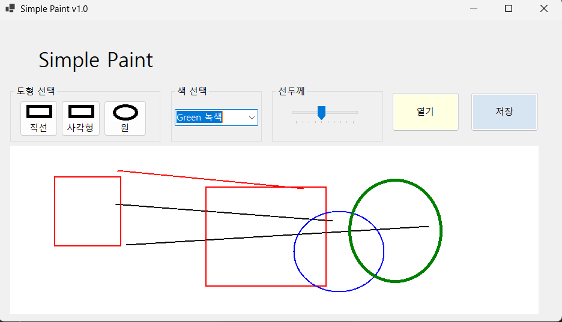
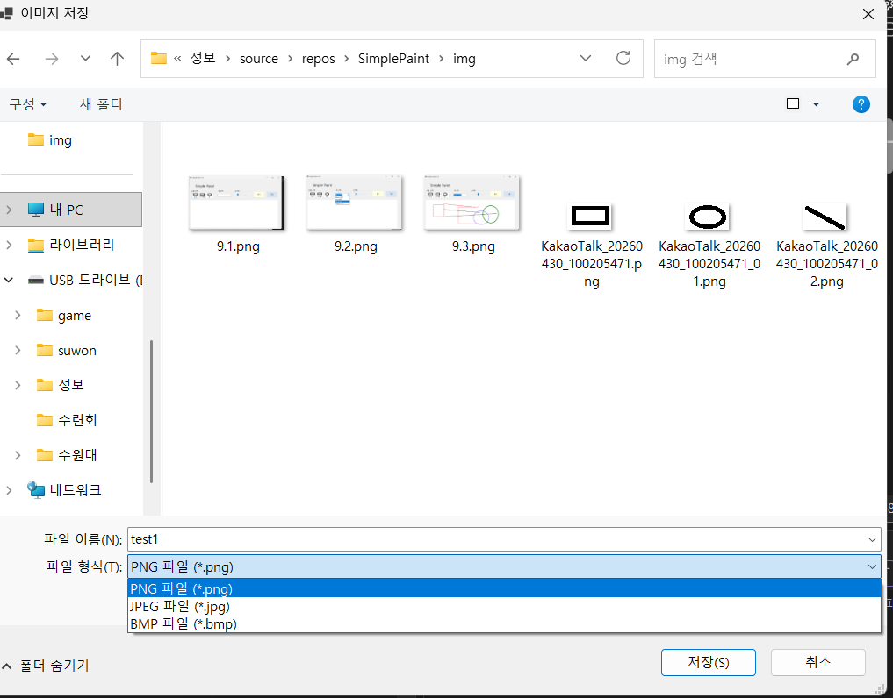
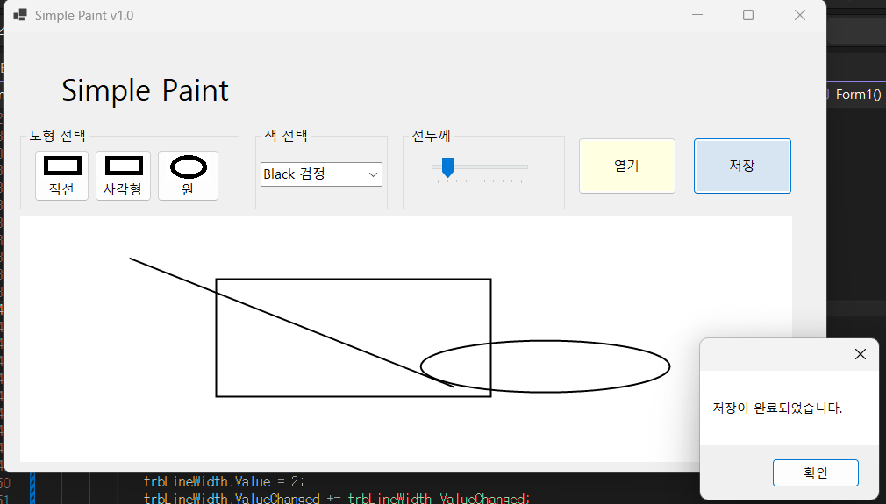
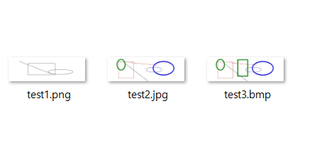
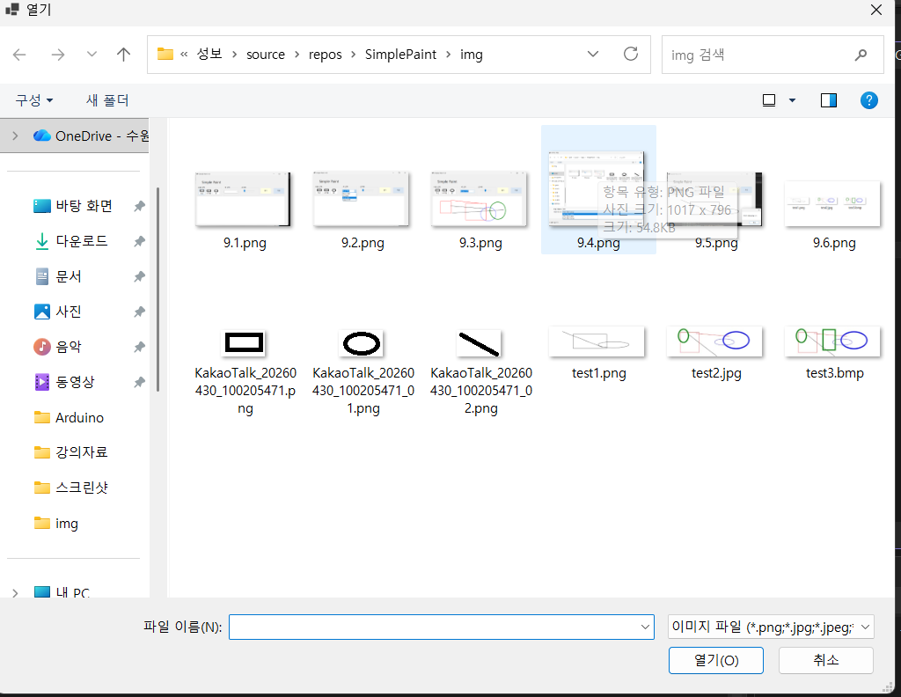
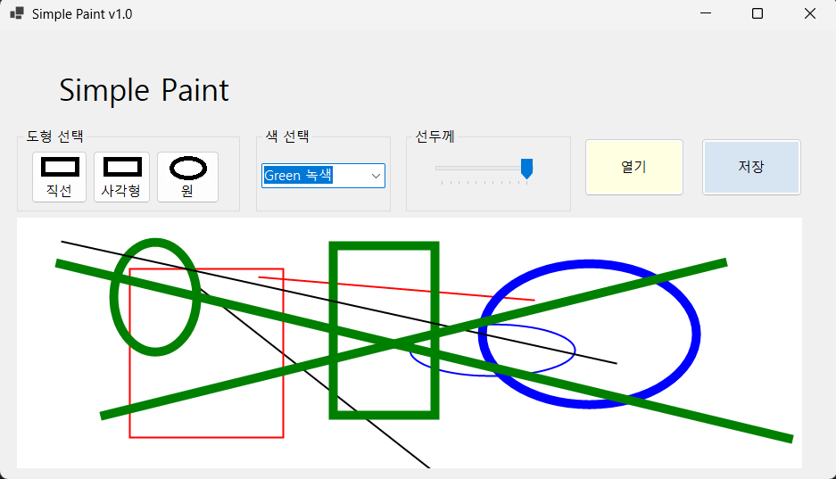

# (C# 코딩) 그림판
## 개요-C# 
프로그래밍학습
-1줄 소개: 직선, 사각형, 원을그릴수있는그림판을만들 수 있습니다.

-사용한플랫폼: 
-C#, .NET Windows Forms, Visual Studio, GitHub

-사용한컨트롤:
-PictureBox, ComboBox, TrackBar,GroupBox,Button,Label

-핵심기능:

## 실행화면(과제1)
-1단계코드의실행스크린샷(여기에이미지삽입)

-구현한내용(위그림참조)

    -UI 구성: Label(앱이름표시), Button2개(열기, 저장),도형선택, 선 두께, 색상선택
    -도형 선택: 직선,사각형,원을 Button을 이용하여 선택
    -선 두께: TrackBar를 이용하여 두께 조절
    -색상선택: ComboBox를 사용하여 선택

## 실행화면(과제2)
-2단계코드의실행스크린샷(여기에이미지삽입)

-구현한내용(위그림참조)

    -기능 구현: 도형선택, 색선택, 선굵기조절,그리기 기능 구현
    -도형선택: Button 클릭 이벤트로 선택된 도형 설정
    -색상선택: ComboBox 선택 이벤트로 선택된 색상 설정
    -선굵기조절: TrackBar 값 변경 이벤트로 선 굵기 설정
    -그리기 기능: PictureBox의 MouseDown, MouseMove, MouseUp 이벤트를 사용하여 도형 그리기 구현
    -도형 그리기: 마우스 드래그로 도형의 시작점과 끝점을 지정하여 그리기 구현
    -도형 종류에 따라 직선, 사각형, 원을 그리는 로직 구현
    
## 실행화면(과제3)
-3단계코드의실행스크린샷(여기에이미지삽입)

-구현한내용(위그림참조)

    -저장시스템 구현: 그려진 도형을 이미지 파일로 저장하는 기능 구현
    -3가지포맷으로저장

## 실행화면(과제4)
-4단계코드의실행스크린샷

-구현한내용(위그림참조)

    -열기시스템 구현: 저장된 이미지 파일을 불러와서 PictureBox에 표시하는 기능 구현
    -파일열기: 열기 버튼 클릭 시 OpenFileDialog를 사용하여 이미지 파일 선택 후 PictureBox에 표시